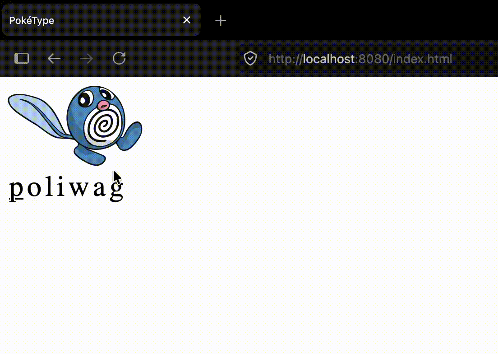

# PokéType - Pokémon skrive-eventyr

Et mindre full stack projekt til at øve REST, JSON og databasekald med dynamisk Javascript interaktion.


---
## Hvad er PokéType?
Det er enormt kedeligt for de små at lære at skrive computer og stave til "hest" og "hund" osv. 
Af inspiration fra min niece (som er helt tosset med Pokémon) kom idéen af at lave et skriftspil, hvor man blot skriver en Pokémons navn for at "fange" den.

## Sådan virker det
- Backend henter og cacher Pokémon-data (navn, type, sprite) fra PokeAPI i en lokal MySQL-database
- REST API'et serverer data til frontend
- Vanilla JS matcher tastetryk mod det korrekte bogstav og highlighter fremskridt live


## Opsætning

1. Klon repo
```bash
   git clone https://github.com/jsdsdal/poketype.git
```
2. Opret en MySQL-database kaldet `poketype`
3. Opret `src/main/resources/application.properties` (findes ikke i repoet, se `application.properties.example`)
   med dine egne DB-credentials
4. Kør appen — ved første opstart seedes databasen automatisk fra PokeAPI (tager et øjeblik)
5. Åbn `localhost:8080/index.html`

## Tech stack
**Backend**
- Java, Spring Boot
- Spring Data JPA / Hibernate
- Spring RestClient (til at hente data fra PokeAPI)
- MySQL

**Frontend**
- HTML, CSS, vanilla JavaScript (ingen framework)

## Anerkendelse
Stort tak til [PokeAPI](https://pokeapi.co/) for at stille data og sprites frit til rådighed.
Pokémon og alle relaterede navne/billeder tilhører Nintendo/Game Freak/The Pokémon Company.
Dette er et ikke-kommercielt hobbyprojekt lavet i forb. med uddannelse uden tilknytning til disse selskaber.